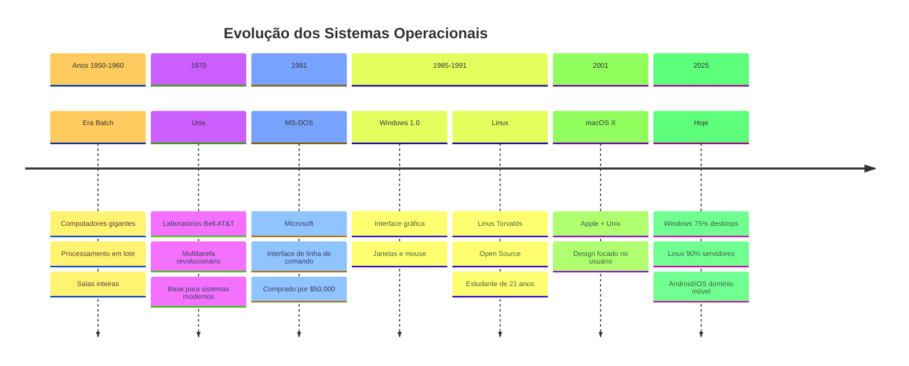
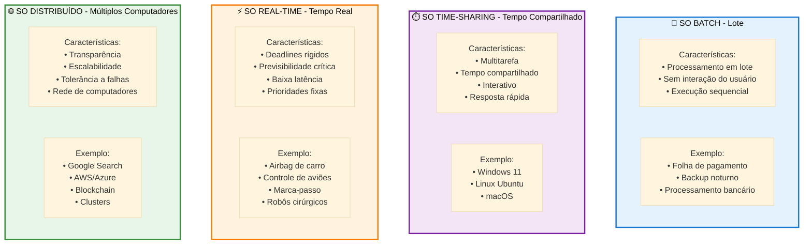
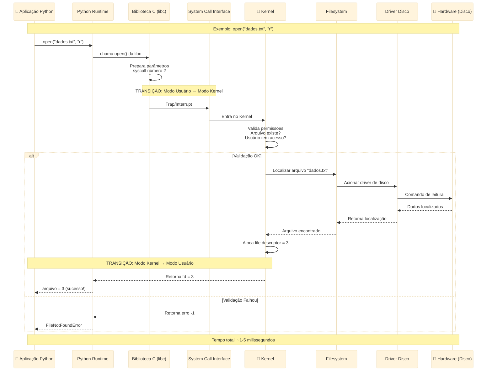

# 🎓 **Dia 1: Bem-vindo ao Mundo dos Sistemas Operacionais**

---

## 📋 **OBJETIVOS DE APRENDIZAGEM (SMART)**

Ao final deste dia de estudo, você será capaz de:

1. **Explicar** com suas próprias palavras o que é um Sistema Operacional e qual seu propósito (3-5 funções principais)
2. **Identificar** os 4 componentes principais de um SO (kernel, shell, drivers, filesystem) e descrever a função de cada um
3. **Distinguir** entre pelo menos 3 tipos diferentes de SO (batch, time-sharing, real-time) citando exemplos práticos
4. **Demonstrar** como executar comandos básicos no terminal para explorar processos e informações do seu sistema
5. **Descrever** a jornada de um system call desde a aplicação até o hardware usando o diagrama de camadas

---

## 🎭 **ATIVAÇÃO DO CONHECIMENTO PRÉVIO**

### Perguntas para Reflexão

Antes de começarmos, pense nestas questões (não precisa responder agora, apenas reflita):

- **Você já parou para pensar em quantos programas estão rodando no seu computador NESTE EXATO MOMENTO?** Quem decide quem usa a memória? Quem controla o acesso ao disco?
- **Quando você salva um arquivo ou imprime um documento, quem realmente faz isso acontecer?** O Word? O Chrome? Ou tem alguém "por trás dos panos"?
- **Por que alguns programas funcionam no Windows mas não no Mac?** E por que aplicativos de celular são diferentes para Android e iPhone?

### 🎼 A Analogia Central: O Maestro da Orquestra Digital

Imagine uma grande orquestra sinfônica prestes a tocar uma peça complexa. Você tem dezenas de músicos (aplicativos), cada um com seu instrumento (recursos do computador), mas todos precisam tocar em harmonia. Sem um maestro, seria um caos absoluto: todos tocariam ao mesmo tempo, ninguém respeitaria o tempo, instrumentos colidiriam uns com os outros.

**O Sistema Operacional é o maestro dessa orquestra digital.** Ele coordena quando cada "músico" (programa) pode tocar, distribui os "instrumentos" (CPU, memória, disco), garante que ninguém toque por cima do outro, e faz tudo isso milhares de vezes por segundo, de forma tão suave que você nem percebe.

Agora, imagine que você abre o navegador, o Spotify e um editor de texto simultaneamente. O maestro (SO) precisa: dar um pouco de processador para cada um, garantir que suas memórias não se misturem, coordenar o acesso ao disco para salvar arquivos, e ainda gerenciar a saída de som para o Spotify. **Tudo ao mesmo tempo, sem que você precise se preocupar com nada disso.** Essa é a magia de um Sistema Operacional!

---

## 📚 **APRESENTAÇÃO DO CONTEÚDO**

### 🔷 **1. O que é um Sistema Operacional?**

#### Definição Simples
Um **Sistema Operacional (SO)** é um software especial que gerencia todos os recursos do seu computador e serve como ponte entre você (e seus aplicativos) e o hardware.

#### Analogia: O Gerente do Hotel
Pense no SO como o **gerente de um hotel**:
- **Recepcionista**: atende seus pedidos (você abre um programa)
- **Administrador de quartos**: aloca memória para cada programa
- **Manobrista**: organiza o estacionamento (gerencia o disco)
- **Segurança**: garante que um hóspede não invada o quarto do outro (proteção de memória)
- **Manutenção**: cuida dos equipamentos (gerencia hardware)

#### As 5 Funções Principais de um SO

1. **Gerenciamento de Processos**
   - *Analogia*: Como um diretor de trânsito coordena carros em um cruzamento
   - Decide qual programa usa o processador e por quanto tempo
   - Exemplo: você tem 10 abas abertas no navegador, o SO alterna entre elas rapidamente

2. **Gerenciamento de Memória**
   - *Analogia*: Como um bibliotecário organiza livros nas prateleiras
   - Aloca espaço na RAM para cada programa
   - Garante que programas não acessem memória uns dos outros

3. **Gerenciamento de Arquivos**
   - *Analogia*: Como um arquivista organiza documentos em pastas
   - Organiza dados no disco rígido (HD/SSD)
   - Permite criar, ler, modificar e deletar arquivos

4. **Gerenciamento de Dispositivos**
   - *Analogia*: Como um intérprete traduz entre pessoas que falam línguas diferentes
   - Comunica-se com impressoras, teclado, mouse, monitor
   - Usa "drivers" como tradutores específicos para cada dispositivo

5. **Interface com o Usuário**
   - *Analogia*: Como a fachada de uma loja que esconde todo o estoque e logística
   - Fornece uma forma amigável de interagir (janelas, ícones, menus)
   - Esconde a complexidade do hardware

---

### 🔷 **2. História dos Sistemas Operacionais**

#### 📅 Linha do Tempo Visual

**Anos 1950 - 1960: A Era Batch (Lote)**
- Computadores gigantes (do tamanho de salas!)
- Programas rodavam um de cada vez em "lotes"
- *Analogia*: Como uma lavanderia que lava todas as roupas brancas, depois todas as coloridas

**1970: Unix - O Revolucionário**
- Criado nos Laboratórios Bell (AT&T)
- Primeiro SO verdadeiramente multitarefa e multiusuário
- Filosofia: "Faça uma coisa e faça bem feito"
- *Legado*: Base para Linux, macOS, Android

**1981: MS-DOS (Microsoft Disk Operating System)**
- Interface de linha de comando (texto puro)
- Exemplo: `C:\> dir` para listar arquivos
- *Curiosidade*: Bill Gates comprou o DOS por $50.000

**1985: Windows 1.0**
- Primeira tentativa da Microsoft com interface gráfica
- Janelas, mouse, ícones (copiando ideias do Xerox PARC)

**1991: Linux - O SO do Povo**
- Criado por Linus Torvalds (estudante finlandês de 21 anos)
- **Open Source**: código aberto, qualquer um pode ver e modificar
- Hoje roda em 90% dos servidores da internet!

**2001: macOS X**
- Apple reconstrói seu SO usando base Unix
- Foco em design e experiência do usuário

**Hoje (2025)**
- **Windows**: domina desktops (~75% mercado)
- **Linux**: rei dos servidores e supercomputadores
- **macOS**: preferido por designers e desenvolvedores
- **Android/iOS**: sistemas móveis (baseados em Linux/Unix)

#### 📊 **Diagrama: Linha do Tempo dos Sistemas Operacionais**



---

### 🔷 **3. Componentes Principais de um SO**

#### 🧠 **KERNEL (Núcleo)**

**O que é**: O "cérebro" do SO, a parte mais importante que controla tudo.

**Analogia**: O kernel é como o **sistema nervoso central** do corpo humano. Assim como seu cérebro coordena batimentos cardíacos, respiração e movimentos sem você pensar nisso conscientemente, o kernel gerencia processador, memória e dispositivos automaticamente.

**Funções**:
- Escalonamento de processos (decidir qual programa roda quando)
- Gerenciamento de memória física
- Controle de hardware direto
- Segurança e proteção

**Tipos de Kernel**:
1. **Monolítico** (Linux): tudo integrado, rápido mas complexo
2. **Microkernel** (Minix): minimalista, apenas essencial
3. **Híbrido** (Windows, macOS): meio termo

---

#### 🐚 **SHELL (Casca)**

**O que é**: A interface entre você e o kernel. Pode ser gráfica (GUI) ou texto (CLI).

**Analogia**: O shell é como o **painel de controle de um avião**. O piloto (você) não mexe diretamente nos motores (kernel), mas usa botões e alavancas (comandos) que comunicam suas intenções ao sistema.

**Tipos**:
- **CLI (Command Line Interface)**: Prompt de Comando, PowerShell, Bash, Zsh
  - Exemplo: `ls -la` (listar arquivos no Linux)
- **GUI (Graphical User Interface)**: Windows Explorer, GNOME, KDE
  - Cliques, janelas, ícones

**Exemplos de Comandos**:
```bash
# Linux/Mac
ls              # listar arquivos
cd /home        # mudar diretório
ps              # ver processos rodando
top             # monitor de processos em tempo real
```

```cmd
# Windows
dir             # listar arquivos
cd C:\Users     # mudar diretório
tasklist        # ver processos rodando
```

---

#### 🔌 **DRIVERS (Motoristas)**

**O que é**: Pequenos programas que "traduzem" entre o SO e dispositivos de hardware.

**Analogia**: Drivers são como **intérpretes simultâneos em uma conferência da ONU**. O SO "fala" uma língua padrão, mas cada impressora, placa de vídeo ou mouse "fala" sua própria língua. O driver traduz entre eles.

**Exemplos**:
- Driver de impressora: converte seu documento em comandos que a impressora entende
- Driver de placa de vídeo: traduz comandos gráficos em pixels na tela
- Driver de áudio: converte sinais digitais em som nos alto-falantes

**Por que precisamos deles?**
Sem drivers, você precisaria reescrever seu programa para cada modelo de impressora, placa de vídeo, etc. Com drivers, você escreve uma vez e o driver faz a adaptação!

---

#### 📁 **FILESYSTEM (Sistema de Arquivos)**

**O que é**: A forma como o SO organiza e armazena dados no disco.

**Analogia**: O filesystem é como o **sistema de organização de uma biblioteca**. Não basta ter livros (dados), você precisa de prateleiras (diretórios), etiquetas (nomes de arquivos), e um sistema de catalogação (índices) para encontrar o que precisa.

**Estrutura Hierárquica**:
```
/ (raiz no Linux) ou C:\ (Windows)
├── home/ ou Users/
│   ├── joao/
│   │   ├── Documentos/
│   │   ├── Downloads/
│   │   └── Imagens/
├── etc/ (configurações do sistema)
├── bin/ (programas executáveis)
└── var/ (arquivos variáveis, logs)
```

**Tipos Comuns**:
- **NTFS** (Windows): suporta arquivos grandes, permissões, criptografia
- **ext4** (Linux): rápido, confiável, jornaling (recuperação de falhas)
- **APFS** (macOS): otimizado para SSDs, snapshots, criptografia nativa
- **FAT32** (pendrives): simples, compatível com tudo, limites de 4GB por arquivo

---

### 🔷 **4. Tipos de Sistemas Operacionais**

#### 🎯 **SO Batch (Lote)**

**Conceito**: Processa tarefas em lote, uma após a outra, sem interação do usuário.

**Analogia**: Como uma **lavadora de roupas**. Você coloca todas as roupas (tarefas), aperta o botão, e ela processa tudo automaticamente do início ao fim sem sua intervenção.

**Características**:
- Nenhuma interação durante execução
- Eficiente para grandes volumes de trabalho repetitivo
- Usado em processamento de folha de pagamento, backup noturno

**Exemplo Real**: Sistemas bancários que processam milhões de transações à noite.

---

#### ⏱️ **SO Time-Sharing (Tempo Compartilhado)**

**Conceito**: Divide o tempo do processador entre múltiplos usuários/programas, criando a ilusão de simultaneidade.

**Analogia**: Como um **professor atendendo vários alunos**. Ele passa 2 minutos com cada aluno, mas dá tanta atenção a cada um que parece que está ajudando todos ao mesmo tempo.

**Características**:
- Multitarefa
- Resposta rápida (milissegundos)
- Cada processo recebe uma "fatia" de tempo (time slice)
- **Seu Windows/Linux/macOS é time-sharing!**

**Exemplo Prático**: Você editando um documento enquanto ouve música e faz download. O SO alterna entre esses programas tão rápido (centenas de vezes por segundo) que parece simultâneo.

---

#### ⚡ **SO Real-Time (Tempo Real)**

**Conceito**: Garante que tarefas críticas sejam executadas dentro de prazos rigorosos (deadlines).

**Analogia**: Como um **piloto de Fórmula 1**. Não basta virar o volante "em algum momento", tem que ser EXATAMENTE no milissegundo certo, senão bate no muro.

**Tipos**:
- **Hard Real-Time**: falhar o deadline = catástrofe (airbags de carros, controle de aviões)
- **Soft Real-Time**: falhar o deadline = qualidade reduzida (streaming de vídeo)

**Características**:
- Previsibilidade > Velocidade
- Latência extremamente baixa
- Prioridades rígidas

**Exemplos Reais**:
- Sistema de freios ABS do carro
- Marca-passos cardíacos
- Controle de usinas nucleares
- Robôs cirúrgicos

---

#### 🌐 **SO Distribuído**

**Conceito**: Múltiplos computadores trabalhando juntos como se fossem um único sistema.

**Analogia**: Como uma **empresa com filiais em várias cidades**. Cada escritório (computador) trabalha independentemente, mas todos compartilham dados e coordenam esforços como uma única organização.

**Características**:
- Transparência: usuário não sabe quantos computadores estão envolvidos
- Escalabilidade: adicione mais máquinas para mais poder
- Tolerância a falhas: se um computador cai, outros continuam

**Exemplos Reais**:
- Google: suas buscas são processadas por milhares de servidores simultaneamente
- Bitcoin: blockchain é um SO distribuído sem dono central
- Nuvem (AWS, Azure): seus arquivos estão em vários datacenters

#### 📊 **Diagrama: Comparação entre Tipos de SO**



---

### 🔷 **5. Arquitetura em Camadas**

#### 📊 **Diagrama: As 5 Camadas de um Sistema Computacional**

**[DIAGRAMA INTERATIVO ACIMA - Arquitetura em Camadas]**

#### 🔍 **Explicação Camada por Camada**

**Camada 5 - Aplicações do Usuário**
- Programas que você usa diariamente
- Não têm acesso direto ao hardware (segurança!)
- Dependem das camadas inferiores

**Camada 4 - Interface do Sistema**
- Sua "janela" para o sistema
- Traduz cliques e comandos em operações

**Camada 3 - System Calls (API do SO)**
- **A camada mais importante para programadores!**
- Funções que o SO disponibiliza para programas
- Ponte segura entre modo usuário e modo kernel

**Camada 2 - Kernel**
- O "cérebro" que faz o trabalho pesado
- Acesso privilegiado ao hardware
- Roda em "modo kernel" (modo protegido)

**Camada 1 - Hardware**
- Componentes físicos
- Apenas o kernel acessa diretamente

---

#### 🏗️ **Por Que Camadas?**

**Analogia**: Pense em um **edifício corporativo**:
- **Térreo (Hardware)**: sala de máquinas, geradores
- **2º andar (Kernel)**: engenheiros que operam as máquinas
- **3º andar (System Calls)**: recepcionistas que recebem pedidos
- **4º andar (Interface)**: atendentes que falam sua língua
- **5º andar (Aplicações)**: você, o cliente final

Você não pode descer até a sala de máquinas e mexer nos cabos (inseguro!). Você fala com o atendente, que passa para o recepcionista, que passa para o engenheiro, que opera a máquina. **Cada camada protege e abstrai a complexidade da camada inferior.**

**Vantagens**:
- **Segurança**: aplicativos não podem travar o sistema
- **Portabilidade**: troque o hardware, as aplicações continuam funcionando
- **Manutenção**: conserte uma camada sem afetar as outras

---

### 🔷 **6. System Calls: A Ponte Mágica**

#### O que são System Calls?

**Definição**: Funções especiais fornecidas pelo kernel que permitem que programas solicitem serviços do sistema operacional.

**Analogia**: System calls são como **ligar para um serviço de atendimento ao cliente**. Você não vai pessoalmente na fábrica (kernel), mas telefona (system call) pedindo algo, e eles fazem acontecer nos bastidores.

#### 📞 **Categorias de System Calls**

1. **Gerenciamento de Processos**
   - `fork()`: cria um novo processo (clone do atual)
   - `exec()`: executa um novo programa
   - `exit()`: encerra o processo
   - `wait()`: espera um processo filho terminar

2. **Gerenciamento de Arquivos**
   - `open()`: abre um arquivo
   - `read()`: lê dados de um arquivo
   - `write()`: escreve dados em um arquivo
   - `close()`: fecha um arquivo

3. **Gerenciamento de Dispositivos**
   - `ioctl()`: controla dispositivos de I/O
   - `read()/write()`: também usados para dispositivos

4. **Comunicação entre Processos**
   - `pipe()`: cria um canal de comunicação
   - `socket()`: cria um socket de rede

5. **Informações do Sistema**
   - `getpid()`: obtém ID do processo
   - `time()`: obtém hora atual
   - `uname()`: obtém informações do SO

---

#### 🔄 **Anatomia de um System Call: A Jornada Completa**

**Cenário**: Seu programa em Python quer ler um arquivo chamado "dados.txt"

**Passo a Passo**:

1. **Você escreve o código**:
   ```python
   arquivo = open("dados.txt", "r")  # Função Python
   conteudo = arquivo.read()
   ```

2. **Python chama a biblioteca padrão** (libc):
   - `open()` do Python chama `open()` da biblioteca C

3. **A biblioteca prepara o system call**:
   - Coloca parâmetros em registradores especiais
   - Coloca o número do system call (ex: `open` = 2 no Linux)

4. **Troca de modo**: Modo Usuário → Modo Kernel
   - Processador muda para modo privilegiado
   - **Esta é a "porta de segurança"!**

5. **Kernel recebe o pedido**:
   - Valida parâmetros (arquivo existe? você tem permissão?)
   - Interage com o sistema de arquivos
   - Acessa o disco rígido via driver

6. **Hardware executa**:
   - Disco rígido busca os dados
   - Controlador de disco transfere para memória

7. **Kernel retorna resultado**:
   - Coloca dados na memória do processo
   - Retorna código de sucesso/erro

8. **Volta para modo usuário**:
   - Seu programa recebe um "file descriptor" (número identificador)
   - Você pode agora usar `read()` com esse identificador

**Tempo total**: Milissegundos (mas milhões acontecem por segundo!)

---

#### 🎭 **Visualizando o System Call**

**[DIAGRAMA INTERATIVO ACIMA - Fluxograma de System Call]**

---

#### 💡 **Por Que Não Deixar Aplicativos Acessarem Hardware Direto?**

**Imagine este cenário catastrófico**:

Sem system calls, se o navegador pudesse acessar memória livremente:
- Poderia ler suas senhas armazenadas por outros programas
- Poderia deletar arquivos do sistema
- Um bug no programa poderia travar o computador inteiro
- Malware teria acesso total ao seu PC

**Com system calls**:
- Kernel valida TUDO antes de executar
- Programas ficam "em caixinhas" isoladas (sandboxing)
- Um programa travado não derruba o sistema
- Segurança, estabilidade, controle!

---

#### 📊 **Diagrama: Sequência Detalhada de System Call**



---

### 📖 **GLOSSÁRIO DE TERMOS TÉCNICOS**

| Termo | Definição | Analogia |
|-------|-----------|----------|
| **Kernel** | Núcleo do SO que controla o hardware | Cérebro do corpo humano |
| **Shell** | Interface entre usuário e kernel | Painel de controle de avião |
| **Driver** | Software que traduz entre SO e dispositivo | Intérprete de idiomas |
| **Processo** | Programa em execução | Receita sendo seguida por um cozinheiro |
| **Thread** | Linha de execução dentro de um processo | Cozinheiro fazendo duas tarefas simultaneamente |
| **System Call** | Função que permite programa pedir serviço ao SO | Ligar para atendimento ao cliente |
| **API** | Interface de Programação de Aplicações | Cardápio de restaurante (lista de serviços disponíveis) |
| **Filesystem** | Sistema de organização de arquivos | Sistema de catalogação de biblioteca |
| **Escalonamento** | Decisão de qual processo usar CPU | Diretor de trânsito decidindo quem passa |
| **Modo Kernel** | Modo privilegiado com acesso total ao hardware | Acesso de engenheiro à sala de máquinas |
| **Modo Usuário** | Modo restrito para aplicações normais | Cliente que precisa pedir permissão para tudo |
| **Multitarefa** | Executar vários processos "simultaneamente" | Malabarista com várias bolas no ar |
| **Open Source** | Código aberto, qualquer um pode ver/modificar | Receita pública vs. receita secreta |
| **CLI** | Interface de Linha de Comando (texto) | Digitar comandos no terminal |
| **GUI** | Interface Gráfica do Usuário | Clicar em ícones e janelas |

---

## 💡 **DEMONSTRAÇÃO E MODELAGEM**

### 🖥️ **Exemplo Prático: Rastreando um System Call**

Vamos ver um system call acontecendo na prática!

#### No Linux/Mac

```bash
# 1. Crie um programa Python simples
echo 'print(open("/etc/hostname").read())' > test.py

# 2. Execute com rastreamento de system calls
strace -e openat python3 test.py

# O que você verá:
# openat(AT_FDCWD, "/etc/hostname", O_RDONLY) = 3
#                                             ↑
#                                    File descriptor retornado!
```

**Explicação**:
- `strace`: ferramenta que mostra TODOS os system calls
- `openat`: versão moderna do `open()`
- `O_RDONLY`: flag "read only" (somente leitura)
- `= 3`: kernel retornou file descriptor 3

#### No Windows (PowerShell)

```powershell
# Ver system calls não é tão direto no Windows, mas podemos ver processos:

# 1. Listar todos os processos
Get-Process | Select-Object Name, Id, CPU, WorkingSet | Format-Table

# 2. Ver detalhes de um processo específico
Get-Process -Name "chrome" | Format-List *

# 3. Ver threads de um processo
(Get-Process -Name "chrome")[0].Threads | Select-Object Id, PriorityLevel
```

---

### 🔍 **Visualizando Processos do Sistema**

#### Windows

```powershell
# Abrir Gerenciador de Tarefas
taskmgr

# Via linha de comando
tasklist                    # Lista todos os processos
tasklist /V                 # Versão verbose (detalhada)
tasklist /SVC               # Mostra serviços em cada processo
```

**O que observar no Gerenciador de Tarefas**:
- **CPU (%)**: quanto de processador cada programa usa
- **Memória**: quanto de RAM está alocado
- **Disco**: leituras/escritas por segundo
- **PID**: Process ID (identificador único)

#### Linux

```bash
# Comando básico
ps aux                      # Lista todos os processos

# Monitor interativo (atualiza em tempo real)
top                         # Pressione 'q' para sair
htop                        # Versão mais bonita (precisa instalar)

# Informações do sistema
uname -a                    # Informações do SO
lscpu                       # Informações da CPU
free -h                     # Memória disponível
df -h                       # Espaço em disco
```

---

## 🎯 **PRÁTICA GUIADA: Explorador do Sistema Operacional**

### 🎪 **Exercício Principal: Mapeando Seu Sistema**

#### 🎯 Objetivo
Usar comandos do sistema para descobrir: quantos processos estão rodando, quanto de memória está sendo usado, e quais são os "famintos" de CPU. Você vai sentir o SO em ação!

#### 📝 Contexto e Motivação
Quando você usa o computador normalmente, não vê o que acontece "nos bastidores". Existem DEZENAS (às vezes CENTENAS) de processos rodando que você nem imagina. Este exercício vai abrir seus olhos para o mundo invisível do Sistema Operacional trabalhando.

---

### 🪟 **PARTE 1: Explorando no Windows**

#### Passo 1: Abrir o Prompt de Comando

1. Pressione `Win + R`
2. Digite `cmd` e pressione Enter
3. Uma janela preta aparece - este é o shell!

#### Passo 2: Comandos para Executar

```cmd
REM 1. Listar todos os processos em execução
tasklist

REM 2. Contar quantos processos estão rodando
tasklist | find /c /v ""

REM 3. Ordenar por uso de memória (do maior para menor)
tasklist /FI "STATUS eq RUNNING" | sort /R

REM 4. Ver informações detalhadas do sistema
systeminfo

REM 5. Ver apenas informações do SO
systeminfo | findstr /B /C:"OS"

REM 6. Ver uso de memória
wmic OS get TotalVisibleMemorySize,FreePhysicalMemory
```

#### 📊 Interpretando os Resultados

**Tasklist Output**:
```
Nome da imagem                 PID  Mem (KB)
chrome.exe                    4532   350,234
explorer.exe                  2156   125,678
System                           4    12,456
```

- **Nome da imagem**: nome do programa executável
- **PID**: Process ID - identificador único do processo
- **Mem (KB)**: memória RAM usada em kilobytes

**Dicas de Interpretação**:
- Chrome com muita memória? Normal, cada aba é um processo!
- "System" (PID 4): é o próprio kernel do Windows
- Mais de 100 processos rodando? Completamente normal!

#### 🎁 Variações Opcionais

```cmd
REM Ver processos de um programa específico
tasklist | findstr "chrome"

REM Ver serviços do Windows
tasklist /SVC

REM Ver processos com uso de CPU (precisa do PowerShell)
powershell "Get-Process | Sort-Object CPU -Descending | Select-Object -First 10"
```

---

### 🐧 **PARTE 2: Explorando no Linux**

#### Passo 1: Abrir o Terminal

- **Ubuntu**: `Ctrl + Alt + T`
- **Mac**: `Cmd + Space`, digite "Terminal"

#### Passo 2: Comandos para Executar

```bash
# 1. Listar processos (formato legível)
ps aux

# 2. Contar quantos processos
ps aux | wc -l

# 3. Ver os 10 processos que mais consomem memória
ps aux --sort=-%mem | head -n 11

# 4. Ver os 10 processos que mais consomem CPU
ps aux --sort=-%cpu | head -n 11

# 5. Informações do sistema operacional
uname -a

# 6. Detalhes do kernel
uname -r                    # Versão do kernel
uname -m                    # Arquitetura (x86_64, ARM)

# 7. Memória disponível
free -h

# 8. Uso de disco
df -h

# 9. Informações da CPU
lscpu

# 10. Monitor em tempo real (pressione 'q' para sair)
top
```

#### 📊 Interpretando os Resultados

**PS AUX Output**:
```
USER  PID  %CPU %MEM    VSZ   RSS TTY  STAT START   TIME COMMAND
root    1   0.0  0.1  16984  8932 ?    Ss   10:23   0:01 /sbin/init
joao 2345   2.3  5.2 234567 89012 ?    Sl   10:25   1:23 /usr/bin/chrome
```

**Explicação das Colunas**:
- **USER**: quem é dono do processo
- **PID**: Process ID
- **%CPU**: porcentagem de CPU usada
- **%MEM**: porcentagem de memória RAM usada
- **VSZ**: memória virtual (em KB)
- **RSS**: memória física real (em KB)
- **STAT**: estado do processo
  - `S` = sleeping (dormindo)
  - `R` = running (rodando)
  - `Z` = zombie (processo morto mas ainda listado)
- **TIME**: tempo total de CPU usado
- **COMMAND**: comando que iniciou o processo

**FREE -H Output**:
```
              total        used        free      shared  buff/cache   available
Mem:          7.7Gi       3.2Gi       1.5Gi       234Mi       3.0Gi       4.1Gi
Swap:         2.0Gi       512Mi       1.5Gi
```

- **total**: memória RAM total instalada
- **used**: memória em uso por processos
- **free**: memória completamente livre
- **buff/cache**: memória usada para cache (pode ser liberada se necessário)
- **available**: memória disponível para novos programas (free + parte do cache)
- **Swap**: "memória virtual" no disco (muito mais lenta que RAM)

#### 🎁 Variações Opcionais

```bash
# Ver processos em árvore (mostra relações pai-filho)
ps auxf

# Ver processos de um usuário específico
ps aux | grep $USER

# Ver apenas processos com GUI (que usam X server)
ps aux | grep X

# Monitoramento avançado (mais bonito que top)
htop        # Precisa instalar: sudo apt install htop

# Ver histórico de comandos que você executou
history
```

---

### 🔬 **PARTE 3: Caça ao Tesouro de Processos**

#### Missão: Encontre Estes Processos no Seu Sistema

Tente encontrar e anotar o PID (Process ID) de cada um:

1. **Processo "System" ou "init" (PID 1 no Linux)**
   - É o "processo pai" de todos os outros
   - Primeiro processo iniciado na boot

2. **Seu navegador (chrome, firefox, safari)**
   - Quantas instâncias dele estão rodando?
   - Qual usa mais memória?

3. **Processo de "explorador de arquivos"**
   - Windows: `explorer.exe`
   - Mac: `Finder`
   - Linux: `nautilus` ou `dolphin`

4. **Processos do sistema que você nunca ouviu falar**
   - Escolha 3 processos com nomes estranhos
   - Pesquise no Google o que fazem

#### 📝 Template para Anotar

```
PROCESSO 1: _______________
PID: _______
Memória usada: _______
O que faz: _______________

PROCESSO 2: _______________
PID: _______
Memória usada: _______
O que faz: _______________

[... continue para os outros ...]
```

---

### 🌍 **Conexão com o Mundo Real**

**Por que isso importa?**

- **Desenvolvedor de Software**: você precisa saber quanto seus programas consomem de recursos
- **Analista de Sistemas**: diagnóstico de problemas ("o sistema está lento" → veja o que está consumindo CPU)
- **Segurança**: malwares aparecem como processos suspeitos
- **Otimização**: identificar programas que iniciam automaticamente e desaceleram o boot

**Cenário Real**:
Seu computador está lento. Você abre o gerenciador de tarefas e vê que "chrome.exe" está usando 90% da CPU. Você descobre que uma aba específica com um site mal-feito tem um loop infinito em JavaScript. Fecha a aba, problema resolvido. **Você acabou de usar conhecimento de SO para resolver um problema real!**

---

## 🔄 **FEEDBACK E AVALIAÇÃO**

### ✅ **Checklist de Verificação**

Marque cada item que você conseguiu completar:

- [ ] Executei comandos no terminal/prompt pela primeira vez
- [ ] Identifiquei pelo menos 10 processos rodando no meu sistema
- [ ] Entendi a diferença entre PID e nome do processo
- [ ] Consegui interpretar uso de memória e CPU
- [ ] Encontrei o processo "System"/"init" (PID 4 ou 1)
- [ ] Descobri quantos processos do Chrome/Firefox estão rodando
- [ ] Entendi que o SO gerencia dezenas de processos simultaneamente
- [ ] Consegui usar pelo menos 5 comandos diferentes
- [ ] Pesquisei o que faz pelo menos 1 processo desconhecido
- [ ] Sinto que entendo melhor como o SO funciona "por baixo"

---

### ⚠️ **Erros Comuns e Soluções**

#### Problema 1: "Comando não reconhecido"

**Sintoma**: `'tasklist' is not recognized as an internal or external command`

**Causas**:
- Você está no PowerShell mas tentou comando do CMD (ou vice-versa)
- Comando é específico de Linux mas você está no Windows

**Solução**:
- Verifique qual terminal você está usando
- Use a seção correta do exercício (Windows ou Linux)
- No Windows, tente abrir "Prompt de Comando" explicitamente

---

#### Problema 2: "Permissão negada" (Linux)

**Sintoma**: `Permission denied` ao tentar executar comando

**Causas**:
- Você precisa de privilégios de administrador

**Solução**:
```bash
# Adicione 'sudo' no início do comando
sudo [seu comando]

# Exemplo:
sudo ps aux
```

---

#### Problema 3: Output muito longo, não consigo ler

**Sintoma**: Centenas de linhas aparecem rapidamente

**Solução**:

**Windows**:
```cmd
REM Redireciona output para arquivo
tasklist > processos.txt

REM Depois abra o arquivo com Notepad
notepad processos.txt
```

**Linux**:
```bash
# Usa 'less' para paginar (setas para navegar, 'q' para sair)
ps aux | less

# Ou salva em arquivo
ps aux > processos.txt
cat processos.txt
```

---

#### Problema 4: "Não entendo o que os números significam"

**Isso é NORMAL!** Você está no Dia 1. Não precisa entender tudo agora.

**Foque nestes 3 números**:
1. **PID**: identificador único (tipo RG do processo)
2. **Memória (KB ou MB)**: quanto de RAM está usando
3. **CPU (%)**: quanto de processador está usando (0% = dormindo, 100% = trabalhando ao máximo)

---

### 🤔 **Auto-Avaliação: Perguntas Reflexivas**

Responda estas perguntas mentalmente ou escreva respostas curtas:

1. **Antes deste estudo, você imaginava que seu computador tinha tantos processos rodando ao mesmo tempo?**

2. **Qual foi a descoberta mais surpreendente ao explorar os processos? (ex: quantidade, nomes estranhos, uso de memória)**

3. **Como você explicaria para um amigo não-técnico o que é um Sistema Operacional, usando suas próprias palavras?**

4. **Qual analogia deste material te ajudou mais a entender? (maestro, hotel, biblioteca, etc.)**

5. **De 0 a 10, quanto você se sente confortável com estes conceitos?**
   - 0-3: Confuso, preciso revisar
   - 4-6: Entendo o básico, mas tenho dúvidas
   - 7-8: Confortável, consigo explicar
   - 9-10: Dominei, poderia ensinar alguém

---

## 🚀 **TRANSFERÊNCIA E APLICAÇÃO**

### 🎁 **Desafio Bônus (Opcional)**

#### Desafio 1: Detetive de Processos 🔍

**Missão**: Identifique um processo "misterioso" no seu sistema.

**Passos**:
1. Liste todos os processos
2. Escolha um com nome que você desconhece completamente
3. Pesquise no Google: "O que é [nome do processo]"
4. Anote: é parte do SO, é um aplicativo, ou é malware?
5. Compartilhe sua descoberta!

**Exemplo**:
- Encontrei: `csrss.exe`
- Pesquisei: "Client/Server Runtime Subsystem"
- Descobri: Processo crítico do Windows, gerencia threads e janelas
- Conclusão: É parte essencial do SO!

---

#### Desafio 2: Caçador de Recursos 🎯

**Missão**: Encontre o processo mais "faminto" de recursos.

**Passos**:
1. Abra o gerenciador de tarefas (Windows) ou `top` (Linux)
2. Ordene por CPU ou Memória
3. Identifique o top 3
4. Analise: por que eles consomem tanto?
5. Teste fechar/reabrir um deles e veja o impacto

**Reflexão**:
- Seu sistema ficou mais rápido sem ele?
- Ele é realmente necessário?
- O que isso te ensina sobre gerenciamento de recursos?

---

#### Desafio 3: Mapa Mental Pessoal 🧠

**Missão**: Crie seu próprio mapa mental do que aprendeu hoje.

Use papel ou ferramenta digital (draw.io, Miro, Canva) e desenhe:
- Centro: "Sistema Operacional"
- Galhos principais: Componentes (kernel, shell, drivers, filesystem)
- Sub-galhos: Tipos de SO, System Calls, etc.
- Use cores, desenhos, suas próprias analogias

**Por quê?** Criar seu próprio mapa mental solidifica o aprendizagem muito mais do que apenas ler.

---

### 🔗 **Conexão com o Próximo Dia**

#### 📚 O que vem a seguir: Dia 2 - Gerenciamento de Processos

Agora que você entende **O QUE** é um SO e **QUAIS** são seus componentes, vamos mergulhar fundo em **COMO** ele gerencia múltiplos processos simultaneamente:

**Prévia do Dia 2**:
- **Ciclo de vida de um processo**: criação, execução, término
- **Escalonamento de CPU**: como o SO decide quem roda quando
- **Estados de processo**: running, ready, waiting, zombie
- **Context switch**: a mágica de trocar processos em milissegundos
- **Threads vs Processos**: qual a diferença?
- **Prática**: Criar processos em Python, simular escalonamento

**Prepare-se pensando**:
- Como o SO decide qual processo usar a CPU quando 100 querem ao mesmo tempo?
- O que acontece quando você abre um programa?
- Como o SO impede que processos interfiram uns com os outros?

---

### 📖 **Recursos Extras para Aprofundamento**

#### 📺 Vídeos Recomendados (YouTube)

1. **"How Do Operating Systems Work?"** - Crash Course Computer Science #18
   - 10 minutos, animações excelentes, inglês com legendas

2. **"Sistema Operacional - Como Funciona?"** - Curso em Vídeo (Gustavo Guanabara)
   - Português, didático, ótimo para iniciantes

3. **"The History of Operating Systems"** - Computerphile
   - Contexto histórico fascinante

#### 📚 Leituras Complementares

1. **"Operating Systems: Three Easy Pieces"** (GRATUITO online!)
   - Livro-texto usado em universidades, muito didático
   - Link: pages.cs.wisc.edu/~remzi/OSTEP/

2. **"Linux Journey"** (GRATUITO)
   - Tutorial interativo para aprender Linux
   - Link: linuxjourney.com

3. **Wikipedia: "Operating System"**
   - Artigo completo, com diagramas, referências

#### 🛠️ Ferramentas para Explorar

1. **VirtualBox** (gratuito)
   - Instale outros SOs em máquinas virtuais
   - Teste Linux sem sair do Windows!

2. **Process Explorer** (Windows - gratuito da Microsoft)
   - Gerenciador de tarefas "turbinado"
   - Veja árvore de processos, DLLs carregadas, etc.

3. **htop** (Linux - gratuito)
   - Monitor de processos interativo e colorido
   - Instale: `sudo apt install htop`

---

## 🎊 **PARABÉNS PELO SEU DIA 1!**

### 🏆 Conquistas Desbloqueadas Hoje

- ✅ **Explorador Iniciante**: Executou comandos de terminal pela primeira vez
- ✅ **Detetive de Processos**: Identificou processos rodando no sistema
- ✅ **Arquiteto Conceitual**: Compreendeu a arquitetura em camadas
- ✅ **Viajante do Tempo**: Conheceu a história dos SOs
- ✅ **Tradutor**: Entendeu a função de system calls

---

### 🌟 Reflexão Final

Você começou o dia sem saber quase nada sobre Sistemas Operacionais. Agora você:

- Sabe que o SO é o "maestro" que coordena tudo
- Entende que existem camadas de abstração protegendo o hardware
- Viu processos reais rodando no seu computador
- Conhece a história e evolução dos SOs
- Compreende conceitos fundamentais como kernel, shell, drivers

**Isso é uma jornada de 1% por dia.** Você não precisa saber tudo agora. Cada dia você constrói sobre o anterior.

---

### 💬 Mensagem de Encorajamento

> "A jornada de mil milhas começa com um único passo." - Lao Tzu

Sistemas Operacionais é um dos tópicos mais complexos e fascinantes da Computação. Você está literalmente aprendendo como computadores realmente funcionam "por baixo do capô".

**Sinta-se orgulhoso**. Muitas pessoas usam computadores a vida inteira sem nunca entender o que você aprendeu hoje.

Nos dias difíceis (e haverá alguns!), lembre-se:
- Todo especialista já foi iniciante
- Confusão é parte do processo de aprendizagem
- Cada conceito que "clica" é uma vitória
- Você está construindo uma base sólida

---

### 🗺️ Roadmap da Jornada (30 dias)

**Semana 1 - Fundamentos**
- ✅ Dia 1: Introdução e Componentes (VOCÊ ESTÁ AQUI!)
- Dia 2: Gerenciamento de Processos
- Dia 3: Threads e Concorrência
- Dia 4: Sincronização e Deadlocks
- Dia 5: Gerenciamento de Memória
- Dia 6-7: Revisão e Prática Semana 1

**Semana 2 - Aprofundamento**
- Dia 8-10: Sistemas de Arquivos
- Dia 11-12: Entrada/Saída e Drivers
- Dia 13-14: Revisão e Projeto Prático

**Semana 3 - Tópicos Avançados**
- Dia 15-17: Virtualização e VMs
- Dia 18-20: Segurança em SO
- Dia 21: Revisão Semana 3

**Semana 4 - Sistemas Modernos**
- Dia 22-24: Sistemas Distribuídos
- Dia 25-27: Containers e Cloud
- Dia 28-30: Projeto Final e Revisão Geral

---

### 📝 Antes de Terminar Hoje

**Tarefa de Casa** (5 minutos):

1. Feche este material
2. Abra um documento em branco
3. Escreva com suas próprias palavras:
   - O que é um Sistema Operacional?
   - Quais são os 3 componentes principais?
   - O que é um system call?

**Se você conseguir escrever algo, PARABÉNS!** Você aprendeu.

Se não conseguir, **não há problema**. Releia as seções que ficaram confusas amanhã. Aprendizagem não é linear.

---

### 🎯 **Checklist Final do Dia 1**

- [ ] Li todo o material com atenção
- [ ] Executei os exercícios práticos (comandos)
- [ ] Explorei processos no meu sistema
- [ ] Entendi as analogias (maestro, hotel, etc.)
- [ ] Revisei o glossário de termos técnicos
- [ ] Fiz a auto-avaliação
- [ ] (Opcional) Tentei um desafio bônus
- [ ] (Opcional) Explorei recursos extras
- [ ] Marquei meu calendário para o Dia 2

---

## 🚀 **Até o Dia 2!**

**Próxima parada**: Gerenciamento de Processos - Como o SO faz malabarismo com centenas de programas ao mesmo tempo!

**Spoiler**: Você vai criar seu próprio processo, simular um escalonador, e entender context switching. Vai ser incrível! 🎪

---

**"O conhecimento é a única ferramenta que se multiplica quando é compartilhada."**

Bons estudos e nos vemos no Dia 2! 🎓✨

---

### 📌 Anotações Pessoais

Use este espaço para anotar:
- Dúvidas que surgiram
- Descobertas interessantes
- Conceitos que precisa revisar
- Ideias para projetos futuros

```
[Espaço para suas anotações]


```

---

**FIM DO DIA 1** 🎉
